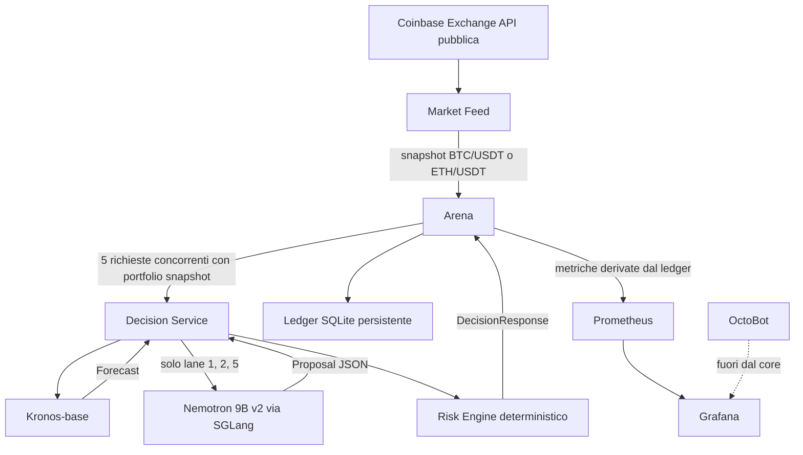

# Dossier tecnico per la revisione AI delle strategie

## Mandato del revisore

Questo documento consegna a una seconda intelligenza artificiale il comportamento effettivo di Fondazione Semplice. Lo scopo non e confermare l'architettura esistente, ma sottoporla a revisione critica e riproducibile.

Il revisore deve distinguere sempre tra:

1. nome dichiarato di una strategia;
2. codice realmente eseguito;
3. controllo deterministico applicato dal Risk Engine;
4. simulazione eseguita da Arena;
5. funzionalita progettata ma non ancora implementata.

Baseline da esaminare:

```text
repository: https://github.com/glaucogaribaldi/fondazionesemplice
commit: bba9fb9675c2a86c1f01cf063afe78a6d2b40dad
release_id: bootstrap-paper-v1.4
mode: paper
timeframe: 5m
markets: BTC/USDT, ETH/USDT
initial capital: 310 USDT per lane
```

Il target sperimentale dichiarato e confrontare cinque percorsi da 310 a 5.000 USDT. Non e una promessa di rendimento e non deve essere usato per giustificare aumento del rischio, overfitting o passaggio prematuro al live.

## Vincoli non negoziabili

- Nessuna chiave Coinbase e richiesta in paper mode.
- `TRADING_MODE=paper`, `LIVE_ENABLED=false` e `LIVE_CONFIRMATION` vuoto sono i default obbligatori.
- Kronos e Nemotron non possono eseguire ordini direttamente.
- Ogni proposta passa dal Risk Engine.
- Arena e l'unico componente che simula i fill.
- Il ledger persistente non deve essere alterato da test sintetici.
- OctoBot non appartiene al percorso decisionale core.
- Una revisione deve dichiarare limiti, assunzioni e rischi; non deve promettere profitti.

## Mappa delle fonti autorevoli

| Tema | File principale |
|---|---|
| Configurazione delle cinque corsie | [`config/strategies.yml`](../config/strategies.yml) |
| Limiti globali | [`config/risk.yml`](../config/risk.yml) |
| Release e bootstrap probe | [`config/release.yml`](../config/release.yml) |
| Schemi Pydantic | [`services/decision-service/app/models.py`](../services/decision-service/app/models.py) |
| Orchestrazione della decisione | [`services/decision-service/app/main.py`](../services/decision-service/app/main.py) |
| Chiamate Kronos/Nemotron e logica quant | [`services/decision-service/app/clients.py`](../services/decision-service/app/clients.py) |
| Risk Engine | [`services/decision-service/app/risk.py`](../services/decision-service/app/risk.py) |
| Sonda bootstrap | [`services/decision-service/app/bootstrap.py`](../services/decision-service/app/bootstrap.py) |
| Inferenza Kronos | [`services/kronos/app/main.py`](../services/kronos/app/main.py) |
| Feed pubblico Coinbase | [`services/market-feed/app/main.py`](../services/market-feed/app/main.py) |
| Normalizzazione feed | [`services/market-feed/app/helpers.py`](../services/market-feed/app/helpers.py) |
| Orchestrazione delle cinque corsie | [`services/arena/app/main.py`](../services/arena/app/main.py) |
| Fill, portafogli e scoring | [`services/arena/app/ledger.py`](../services/arena/app/ledger.py) |
| Topologia e variabili runtime | [`docker-compose.yml`](../docker-compose.yml) |
| Test | [`tests/`](../tests) e [`scripts/e2e_test.py`](../scripts/e2e_test.py) |

## Architettura effettiva



PostgreSQL e avviato nello stack e la relativa URL viene fornita ai servizi, ma il percorso decisionale descritto in questa baseline non persiste decisioni o portafogli in PostgreSQL. La fonte operativa del paper ledger e SQLite.

## Sequenza completa per candela

### 1. Acquisizione dati

Il Market Feed interroga per ogni prodotto:

```text
GET /products/{product}/candles?granularity=300
GET /products/{product}/ticker
```

Le due richieste vengono eseguite in parallelo. Le candele ancora aperte vengono escluse. Le candele chiuse sono ordinate cronologicamente e limitate, di default, alle ultime 96.

Mappature:

```text
BTC-USDT -> BTC/USDT
ETH-USDT -> ETH/USDT
300 secondi -> 5m
```

Identificatore idempotente:

```text
coinbase-{PRODUCT}-{TIMESTAMP_ULTIMA_CANDELA_CHIUSA}
```

BTC ed ETH sono elaborati con `asyncio.gather`; possono quindi raggiungere Arena contemporaneamente.

### 2. Snapshot di portafoglio

Arena costruisce per ciascuna corsia:

```json
{
  "equity": 310.0,
  "cash": 310.0,
  "daily_pnl_pct": 0.0,
  "open_positions": 0,
  "current_position_pct": 0.0,
  "last_trade_at": null
}
```

`current_position_pct` riguarda soltanto il simbolo della richiesta. `open_positions` conta tutte le posizioni della corsia.

### 3. Fan-out sulle cinque corsie

Arena invia cinque richieste concorrenti al Decision Service. Il suffisso della corsia viene aggiunto al request ID della decisione:

```text
{market_request_id}-lane_1
...
{market_request_id}-lane_5
```

Le cinque decisioni usano lo stesso snapshot di mercato. Kronos usa cache e lock per evitare di calcolare cinque volte lo stesso forecast.

### 4. Forecast Kronos

Input:

```json
{
  "symbol": "BTC/USDT",
  "timeframe": "5m",
  "candles": ["32..512 candele OHLCV"]
}
```

In produzione `KronosPredictor` riceve:

```text
max_context = 512
prediction horizon = 12 step
T = 1.0
top_p = 0.9
sample_count = 3
```

Con timeframe `5m`, l'orizzonte nominale e 60 minuti.

La risposta viene sintetizzata con:

```text
predicted_return_pct = (ultimo_close_predetto / ultimo_close_reale - 1) * 100
returns_i             = (prediction_i - prediction_i-1) / prediction_i-1
volatility            = std(returns_i)
confidence            = clip(
                          abs(predicted_return_pct) /
                          (volatility * 10000 + 0.25),
                          0.05,
                          0.95
                        )
```

Classificazione della direzione:

```text
predicted_return_pct >  0.05% -> up
predicted_return_pct < -0.05% -> down
altrimenti                    -> flat
```

La confidenza e quindi una trasformazione euristica dell'ampiezza prevista rispetto alla volatilita della traiettoria generata. Non e, nella baseline, una probabilita calibrata empiricamente.

### 5. Generazione della proposta

#### Percorso quantitativo

Usato direttamente da `lane_3` e `lane_4`; usato anche dalle lane AI quando `AI_BACKEND=mock`.

```python
if confidence < 0.65 or abs(expected_return_pct) < 0.10:
    HOLD
elif direction == "up":
    BUY 8%, stop_loss 1.0%, take_profit 1.8%
elif direction == "down":
    SELL 8%
else:
    HOLD
```

Reason code espliciti:

```text
BUY  -> KRONOS_UP
SELL -> KRONOS_DOWN
HOLD -> nessun reason code nel proposal; il Risk Engine produce MODEL_HOLD
```

Nota: la soglia interna `0.65` precede le soglie specifiche delle corsie. Di conseguenza, una lane configurata con `minimum_confidence=0.60` non puo ottenere dal percorso quantitativo una proposta non-HOLD con confidenza tra 0.60 e 0.65.

#### Percorso Nemotron

Usato da `lane_1`, `lane_2` e `lane_5` quando `AI_BACKEND` non e `mock`.

System prompt effettivo:

```text
You are a constrained trading proposal engine. Return JSON only.
Allowed actions: BUY, SELL, HOLD. Never override risk limits.
```

Nemotron riceve:

- simbolo;
- modalita;
- forecast Kronos completo;
- snapshot del portafoglio;
- schema JSON richiesto.

Parametri principali:

```text
temperature = 0
max_tokens = 300
response_format = json_object
```

Schema di output:

```json
{
  "action": "BUY|SELL|HOLD",
  "allocation_pct": 0.0,
  "confidence": 0.0,
  "stop_loss_pct": null,
  "take_profit_pct": null,
  "reason_codes": ["UPPER_SNAKE_CASE"]
}
```

Il prompt non contiene ancora una policy distinta per lane. Le tre corsie AI ricevono lo stesso prompt e gli stessi dati; la differenziazione avviene principalmente nei limiti successivi del Risk Engine.

### 6. Sonda bootstrap v1.4

Prima del forecast viene valutata una regola speciale:

```text
enabled
AND mode == paper
AND symbol == BTC/USDT
AND request_id inizia con coinbase-BTC-USDT-
AND last_trade_at is null
AND open_positions == 0
AND current_position_pct == 0
```

Se vera, Kronos e Nemotron non vengono chiamati. La proposta e:

```json
{
  "action": "BUY",
  "allocation_pct": 1.0,
  "confidence": 1.0,
  "stop_loss_pct": 1.0,
  "take_profit_pct": 1.8,
  "reason_codes": ["BOOTSTRAP_PROBE"]
}
```

La sonda e un controllo operativo una tantum, non un segnale predittivo. Sulla VPS v1.3 ha gia prodotto un fill per ciascuna corsia; l'aggiornamento v1.4 non deve ripeterlo.

### 7. Risk Engine

Il Risk Engine riceve `DecisionRequest`, `Proposal`, limiti globali e limiti della corsia.

Controlli globali:

| Controllo | Regola | Reason code |
|---|---|---|
| Simbolo | Deve essere in `allowed_symbols` | `SYMBOL_NOT_ALLOWED` |
| Freschezza | Eta tra -5 e 90 secondi | `STALE_MARKET_DATA` |
| Spread | Massimo 35 bps | `SPREAD_TOO_WIDE` |
| Confidenza | Proposal >= soglia lane per BUY/SELL | `CONFIDENCE_TOO_LOW` |
| Allocazione | <= min(20%, max lane) | `ALLOCATION_LIMIT` |
| Perdita giornaliera | Non oltre limite lane | `DAILY_LOSS_LIMIT` |
| Posizioni aperte | BUY vietato al limite | `OPEN_POSITION_LIMIT` |
| Cooldown | Nessun trade entro finestra lane | `COOLDOWN_ACTIVE` |
| Stop loss BUY | Obbligatorio tra 0.25% e 3% | `STOP_LOSS_REQUIRED` / `STOP_LOSS_OUT_OF_RANGE` |
| Take profit | Massimo 8% | `TAKE_PROFIT_OUT_OF_RANGE` |
| Live | Due controlli espliciti | `LIVE_TRADING_LOCKED` |

Semantica finale:

```text
Proposal HOLD:
    approved = true
    action = HOLD
    allocation = 0
    TTL = 60 secondi

Proposal BUY/SELL con almeno un reason di rifiuto:
    approved = false
    action = HOLD
    allocation = 0
    TTL = 30 secondi

Proposal BUY/SELL senza rifiuti:
    approved = true
    action = proposal.action
    allocation = proposal.allocation_pct
    TTL <= 300 secondi
```

Un HOLD puo risultare `approved=true` anche quando sono presenti reason code come dato vecchio o spread eccessivo. Questo significa che il sistema approva l'assenza di azione, non la qualita del dato.

Se qualunque eccezione attraversa il percorso decisionale:

```text
decision = HOLD
approved_by_risk_engine = false
reason_codes = [FAIL_CLOSED, TIPO_ECCEZIONE]
model_versions = unavailable
```

### 8. Esecuzione paper in Arena

Arena esegue le cinque DecisionResponse in sequenza dopo averle raccolte in parallelo.

#### BUY

```text
fill_price      = ask * (1 + slippage_bps / 10000)
target_notional = min(
                    equity * allocation_pct / 100,
                    cash / (1 + fee_rate)
                  )
quantity        = target_notional / fill_price
fee             = target_notional * fee_rate
cash_new        = cash - target_notional - fee
```

Se esiste gia una posizione sul simbolo, viene aggiornato il prezzo medio ponderato.

#### SELL

```text
fill_price      = bid * (1 - slippage_bps / 10000)
target_quantity = equity * allocation_pct / 100 / fill_price
quantity        = min(held_quantity, target_quantity)
proceeds        = quantity * fill_price
fee             = proceeds * fee_rate
realized_pnl    = quantity * (fill_price - average_price) - fee
cash_new        = cash + proceeds - fee
```

`allocation_pct` sul SELL rappresenta quindi un controvalore percentuale dell'equity, non una percentuale della quantita posseduta.

Un SELL senza posizione viene trasformato da Arena in HOLD con `NO_POSITION_TO_SELL`.

#### Idempotenza

La chiave unica e:

```text
(market_request_id, lane_id)
```

La ripetizione della stessa richiesta restituisce l'evento esistente e non produce un secondo fill.

#### Mark-to-market e scoring

```text
equity       = cash + sum(quantity * last_price)
drawdown_pct = (peak_equity - equity) / peak_equity * 100
return_pct   = (equity / initial_capital - 1) * 100
fee_pct      = fees / initial_capital * 100
score        = return_pct - 2 * max_drawdown_pct - fee_pct
```

Il `last_price` viene aggiornato soltanto per il simbolo della richiesta corrente. Le altre posizioni conservano l'ultimo prezzo osservato per il rispettivo simbolo.

### 9. Smoke test isolato

Dalla release v1.4:

```text
/v1/evaluate       -> ledger persistente /data/arena.db
/v1/smoke-evaluate -> ledger effimero /tmp/fondazione-smoke/arena.db
```

Lo smoke test usa prezzi sintetici, ma non puo piu modificare posizioni, equity, drawdown o metriche delle corsie persistenti.

## Differenze effettive tra le cinque strategie

| Lane | Percorso proposta | Conf. minima | Max posizione | Perdita giornaliera | Max posizioni | Cooldown |
|---|---|---:|---:|---:|---:|---:|
| `lane_1` | Kronos + Nemotron | 0.75 | 10% | 2% | 2 | 30 min |
| `lane_2` | Kronos + Nemotron | 0.60 | 20% | 4% | 4 | 10 min |
| `lane_3` | Kronos + `quant_proposal` | 0.70 | 12% | 2.5% | 3 | 20 min |
| `lane_4` | Kronos + `quant_proposal` | 0.65 | 10% | 2% | 2 | 20 min |
| `lane_5` | Kronos + Nemotron | 0.68 | 8% | 1.5% | 2 | 30 min |

Osservazioni da non perdere nella revisione:

1. `lane_1`, `lane_2` e `lane_5` non hanno prompt o algoritmo Nemotron distinti.
2. `lane_3` e `lane_4` chiamano la stessa funzione `quant_proposal`.
3. Il nome `technical_baseline` non corrisponde ancora a indicatori tecnici separati come RSI, MACD, medie mobili o breakout.
4. La principale diversita attuale risiede nei parametri del Risk Engine, non nella generazione del segnale.
5. Il proposal quantitativo usa sempre allocazione 8%, stop 1% e take profit 1.8% per BUY, indipendentemente dalla lane.
6. Nemotron puo proporre allocazioni differenti, ma il prompt non gli comunica la policy specifica della lane; il rifiuto avviene successivamente.

## Sicurezza e confini operativi

### Live lock

Una richiesta live e autorizzabile soltanto se:

```text
request.mode == server TRADING_MODE
LIVE_ENABLED == true
LIVE_CONFIRMATION == I_UNDERSTAND_LIVE_TRADING_CAN_LOSE_MONEY
```

Arena rifiuta comunque modalita diverse da `paper`. Nella baseline non esiste quindi un percorso completo di esecuzione live.

### Rete

Decision Service, Arena, Market Feed, SGLang, Grafana e OctoBot sono esposti di default soltanto su localhost. Il profilo pubblico opzionale espone Caddy sulle porte 80/443 e mantiene il login Grafana.

### Timeout

```text
Decision Service verso modelli: 60 s
Arena verso Decision Service:    90 s
Market Feed verso Arena:        120 s
```

La catena converte errori del percorso decisionale in HOLD fail-closed; un errore complessivo di Arena puo invece produrre HTTP 503 verso il Market Feed.

## Punti critici da sottoporre obbligatoriamente a revisione

Questa sezione non anticipa la soluzione. Definisce le domande tecniche che il revisore deve affrontare con evidenze nel codice.

### A. Uscite protettive non eseguite

Il Risk Engine verifica presenza e range di `stop_loss_pct` e `take_profit_pct`, ma Arena non persiste ne monitora livelli stop/take e non genera uscite automatiche quando vengono raggiunti.

Domande:

- Lo stop loss e oggi soltanto metadato validato?
- Come deve essere modellato un ordine protettivo paper persistente e idempotente?
- Quale prezzo deve attivarlo: bid, last, candle low/high o una simulazione intrabar?
- Come gestire gap, slippage e conflitto stop/take nella stessa candela?

### B. Concorrenza BTC/ETH e TOCTOU

BTC ed ETH possono essere elaborati in parallelo. Ogni decisione usa uno snapshot del portafoglio precedente al fill. Il controllo del numero di posizioni e l'esecuzione non sono una singola transazione atomica condivisa con il Risk Engine.

Domande:

- Due BUY concorrenti possono entrambi superare `max_open_positions` o il limite di esposizione?
- Serve una prenotazione di capitale/esposizione per lane?
- Il controllo finale deve essere ripetuto dentro la transazione del ledger?

### C. Strategie nominalmente diverse ma logicamente duplicate

Domande:

- Quali differenze devono risiedere nella generazione del segnale e quali soltanto nel rischio?
- `lane_4` deve diventare una vera baseline tecnica deterministica?
- Le lane Nemotron necessitano prompt, obiettivi e feature set distinti?
- Come evitare che cinque lane misurino quasi soltanto cinque configurazioni di rischio?

### D. Confidenza non calibrata

La confidence Kronos e euristica; la confidence Nemotron e autodichiarata dal modello.

Domande:

- Come calibrare confidence contro frequenze empiriche out-of-sample?
- Conviene separare `forecast_confidence`, `policy_confidence` e `risk_acceptance`?
- Quali reliability diagram, Brier score o expected calibration error usare?

### E. Semantica delle uscite SELL

Domande:

- `allocation_pct` deve indicare percentuale dell'equity o percentuale della posizione?
- Come rappresentare `CLOSE`, `REDUCE` e `REVERSE` senza ambiguita?
- Come impedire SELL ripetuti o involontari su posizioni minime?

### F. Cooldown e riduzione del rischio

Il cooldown viene controllato per ogni BUY o SELL. Puo quindi impedire anche un'uscita che ridurrebbe rischio.

Domande:

- Il cooldown deve bloccare soltanto incremento o inversione dell'esposizione?
- Stop loss, kill switch e chiusura di emergenza devono bypassarlo?

### G. Mark-to-market multi-asset

Domande:

- L'equity e il daily PnL possono usare prezzi non aggiornati di un altro simbolo?
- Serve un price cache centralizzato con timestamp per asset?
- Come deve fallire il sistema se un asset non ha un prezzo fresco?

### H. Uso incompleto della configurazione

Il file `risk.yml` contiene `allowed_actions` e `fail_closed`, ma la baseline non carica questi campi in `RiskSettings`. Il comportamento fail-closed e implementato direttamente nel codice.

Inoltre, il feed operativo usa soltanto mercati USDT mentre `allowed_symbols` conserva anche `BTC/USDC` ed `ETH/USDC`. Questa superficie ammessa deve essere confermata intenzionale oppure ridotta.

Domande:

- Questi campi devono diventare effettivi, essere rimossi o essere dichiarati invarianti non configurabili?
- Quali configurazioni devono essere immutabili per sicurezza?

### I. Persistenza e audit

Domande:

- E sufficiente memorizzare reason code, fill e quantita?
- Devono essere persistiti forecast completo, proposal originale, decisione corretta dal rischio, versioni modello, stop/take e hash della strategia?
- PostgreSQL deve diventare event store/audit store oppure essere rimosso dallo stack finche inutilizzato?

### J. Validita sperimentale

Domande:

- Cinque lane sullo stesso periodo sono sufficienti per confrontare strategie?
- Come introdurre backtest walk-forward, purged cross-validation e confronto contro buy-and-hold/cash?
- Come evitare data snooping nella modifica iterativa delle soglie?
- Quali metriche devono precedere il target nominale 5.000 USDT?

## Formato obbligatorio della risposta del revisore AI

Il revisore deve produrre cinque sezioni.

### 1. Verifica del comportamento

Per ogni lane:

```text
input -> forecast -> proposal -> risk checks -> execution -> persistence -> metrics
```

Indicare se il comportamento dedotto coincide con il codice.

### 2. Findings ordinati per severita

Ogni finding deve usare questo schema:

```text
ID:
Severita: CRITICAL | HIGH | MEDIUM | LOW
Titolo:
File e simboli coinvolti:
Comportamento attuale:
Scenario di fallimento:
Impatto sui risultati paper:
Impatto su un eventuale live futuro:
Correzione proposta:
Test di regressione richiesto:
```

### 3. Valutazione delle cinque strategie

Per ogni lane indicare:

- ipotesi economica realmente testata;
- feature utilizzate;
- regola di entrata;
- regola di uscita;
- sizing;
- rischio;
- differenza effettiva dalle altre lane;
- rischio di duplicazione o overfitting;
- modifiche raccomandate.

### 4. Architettura proposta

Separare chiaramente:

- correzioni necessarie prima di continuare il paper;
- miglioramenti sperimentali;
- requisiti obbligatori prima dello shadow;
- requisiti obbligatori prima del live.

Non proporre il live come semplice cambio di variabile d'ambiente.

### 5. Piano di implementazione

Fornire una sequenza di commit piccoli e verificabili. Per ogni commit indicare file, migrazioni, test, rollback e variazioni delle metriche.

## Comandi suggeriti al revisore

```bash
git checkout bba9fb9675c2a86c1f01cf063afe78a6d2b40dad
python3 scripts/validate_config.py
python3 scripts/validate_strategy_release.py
python3 -m unittest discover -s tests -v
```

Il revisore puo leggere l'intera repository, ma deve citare i file e i simboli usati per ogni conclusione. Non deve modificare la VPS, il ledger o la configurazione runtime durante la fase di analisi.

## Domanda finale da affidare alla seconda AI

> Esamina Fondazione Semplice al commit indicato come se dovessi firmare una revisione indipendente prima di altre 72 ore di paper trading. Ricostruisci il comportamento effettivo, individua differenze tra intenzione e codice, valuta se le cinque lane costituiscono davvero cinque strategie, identifica rischi di simulazione o misurazione e proponi una roadmap verificabile. Non ottimizzare per generare piu trade: ottimizza per validita sperimentale, controllo del rischio, auditabilita e capacita di distinguere un vantaggio reale da rumore o errore software.
